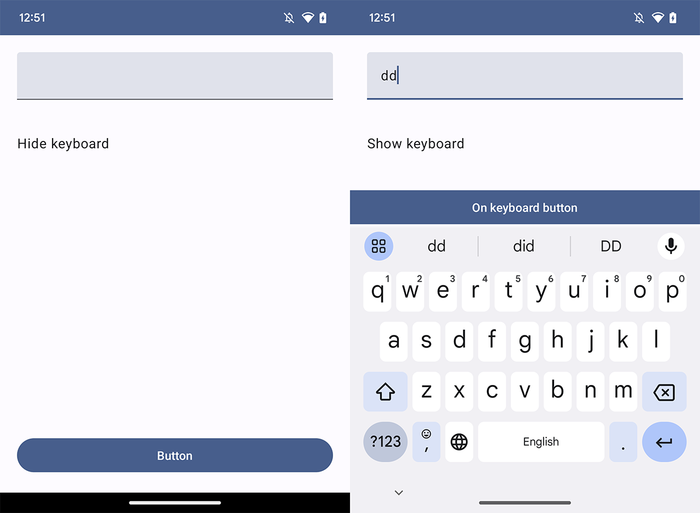

## Summary

Android Compose extension.


## library

- Keyboard show/hide extensions.
- Android System UI Controller


## Compose version info 

- compose 1.6.0-beta02
- compose compiler 1.5.5
- kotlin 1.9.20

## Download - compose 1.6.0-beta

require android 14(target 34, compile 34)

Use gradle - compose 1.6.0-beta02, compose compiler 1.5.5, kotlin 1.9.20

```kotlin
implementation("tech.thdev:extensions-compose-keyboard-state:1.6.0-beta02")
implementation("tech.thdev:extensions-compose-system-ui-controller:1.6.0-beta02")
```

## Download - compose 1.5.4

Use gradle - compose 1.5.4, compose compiler 1.5.4, kotlin 1.9.20

```kotlin
implementation("tech.thdev:extensions-compose-keyboard-state:1.5.4")
implementation("tech.thdev:extensions-compose-system-ui-controller:1.5.4")
```

Release version are available in [Sonatyp's repository.](https://search.maven.org/search?q=tech.thdev)

## Use keyboard extensions

### Use scaffold modifier

```kotlin
CompositionLocalProvider(
     LocalMutableExKeyboardStateSourceOwner provides MutableExKeyboardStateSource()
) {
     Scaffold(
         modifier = Modifier
             .removeFocusWhenKeyboardIsHidden()
     ) {
     }
}
```
 
### when checking status

```kotlin
val keyboardState by mutableKeyboardStateSource.keyboardState()

DisposableEffect(showKeyboard) {
    // Use keyboard state
    onDispose {
    }
}
```

## Use system ui controller

```kotlin
// Remember a SystemUiController
val systemUiController = rememberExSystemUiController()

DisposableEffect(systemUiController) {
    // Update all of the system bar colors to be transparent, and use
    // dark icons if we're in light theme
    systemUiController.setSystemBarsColor(
        color = Color.Transparent,
    )

    // setStatusBarColor() and setNavigationBarColor() also exist

    onDispose {}
}
```

## Sample


